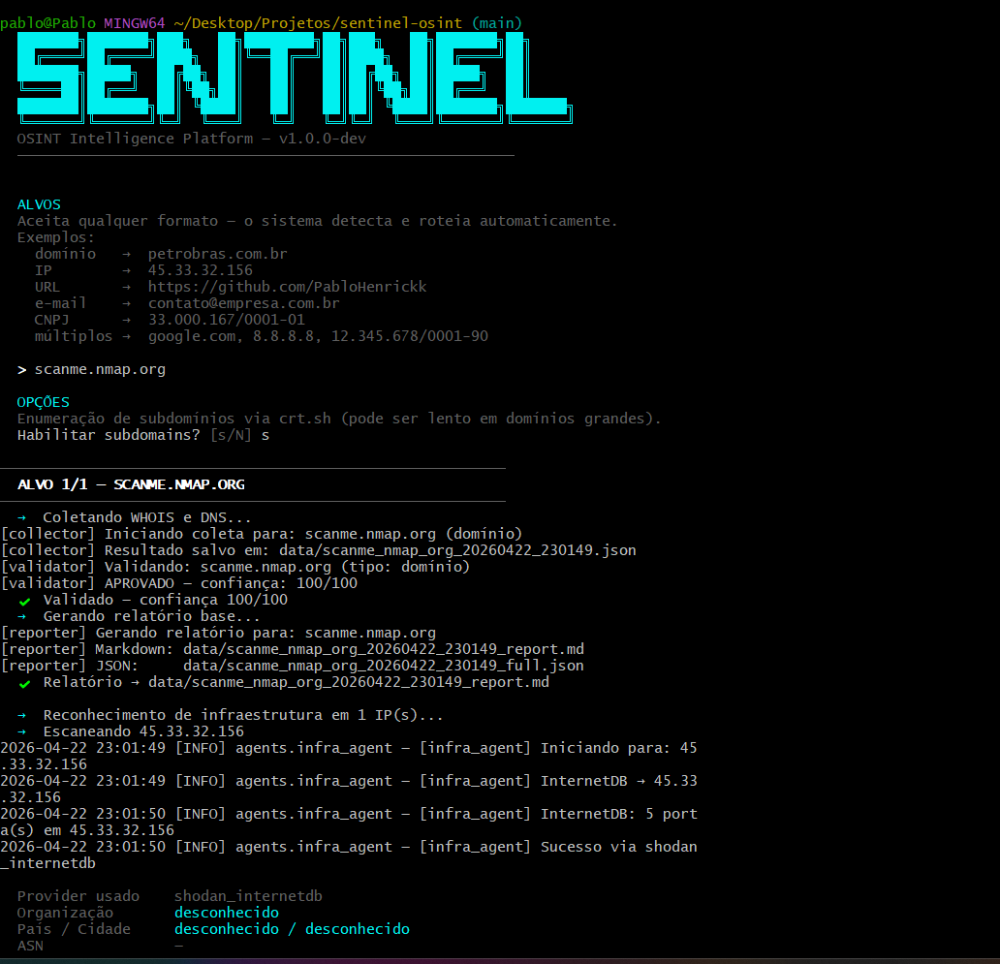
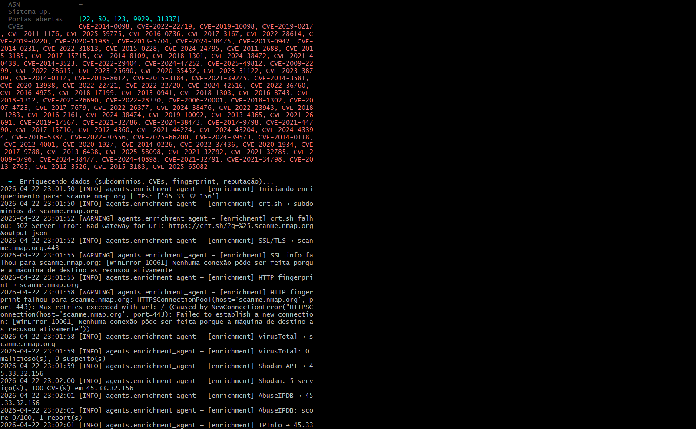
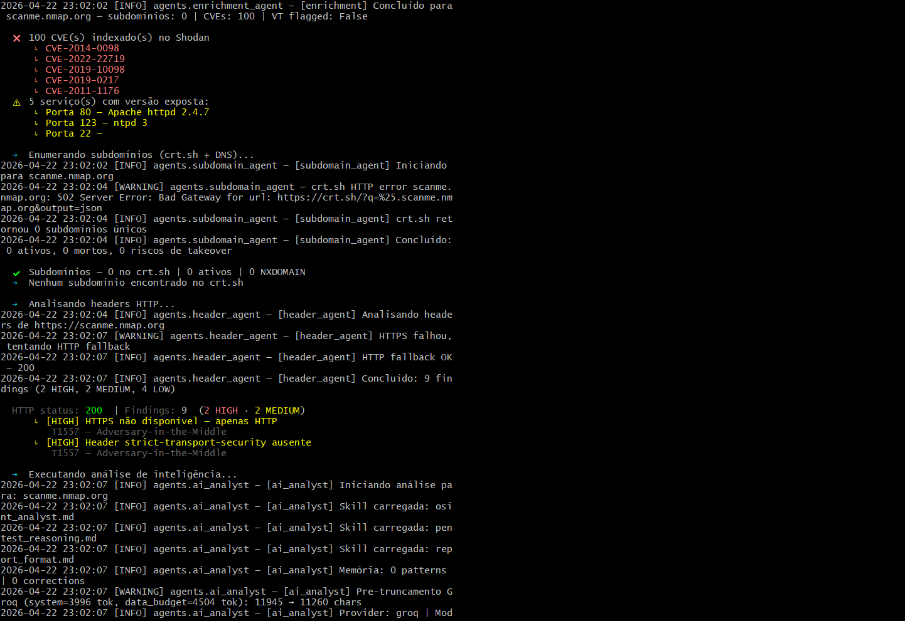
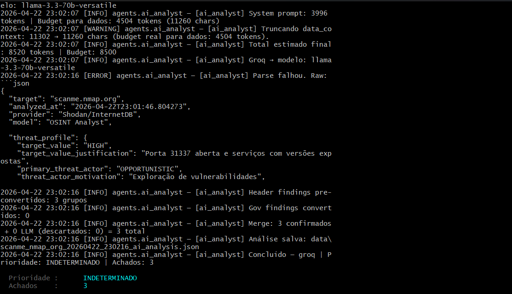
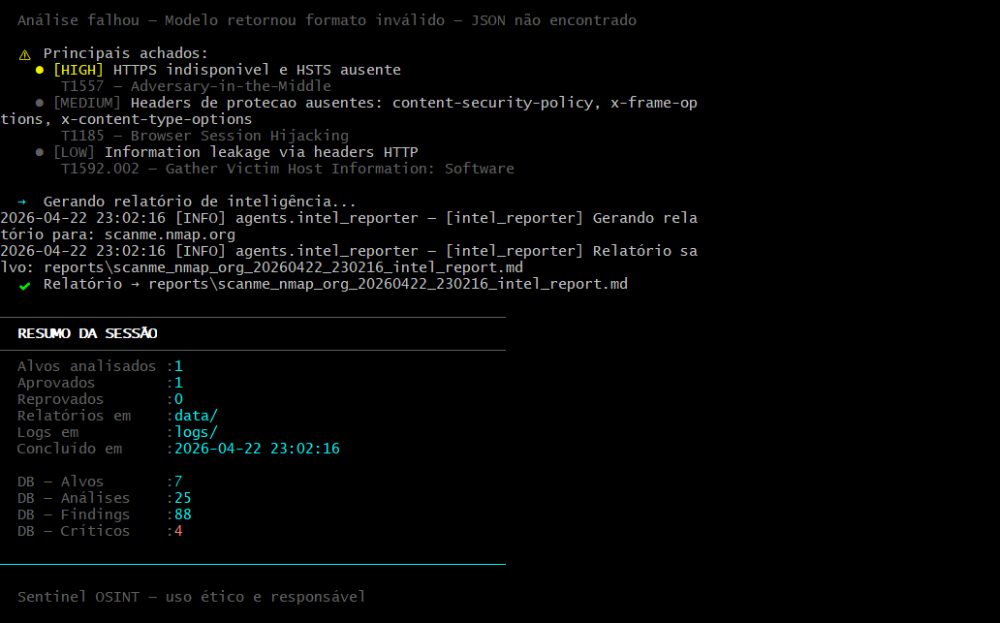

# Sentinel OSINT

> Plataforma modular de inteligência automatizada — coleta, correlaciona e transforma dados públicos em inteligência acionável com análise por LLM e classificação MITRE ATT&CK.


---







---

## O que entrega

Você passa um domínio. O pipeline executa automaticamente e retorna:

```
Alvo: scanme.nmap.org
Confiança: 100/100 ✔
Portas abertas: [22, 80, 123, 9929, 31337]
CVEs indexados: 100 (via Shodan)
Serviços expostos: Apache httpd 2.4.7, ntpd 3
Findings gerados: 9 (2 HIGH · 2 MEDIUM · 4 LOW · 1 INFO)
Relatório: reports/scanme_nmap_org_intel_report.md
```

Cada finding vem com MITRE ATT&CK mapeado, cenário de exploração realista e remediação verificável:

```json
{
  "title": "HTTPS indisponível e HSTS ausente",
  "severity": "HIGH",
  "mitre_id": "T1557",
  "mitre_name": "Adversary-in-the-Middle",
  "exploitation": {
    "complexity": "BAIXA",
    "realistic_scenario": "Atacante executa arpspoof + sslstrip em rede intermediária. Credenciais capturadas em texto claro via Wireshark."
  },
  "recommendation": {
    "action": "Strict-Transport-Security: max-age=31536000; includeSubDomains; preload",
    "verification": "curl -I http://alvo | grep -i strict-transport"
  }
}
```

---

## Pipeline

```
collector → validator → reporter
                ↓
         infra_agent → enrichment_agent → subdomain_agent → header_agent
                                                                  ↓
                                                           ai_analyst
                                                                  ↓
                                                         intel_reporter → database
```

Cada agente entrega JSON padronizado. Falhas são isoladas — o pipeline continua com os dados disponíveis.

| # | Agente | O que faz | Status |
|---|--------|-----------|--------|
| 01 | `collector.py` | WHOIS + DNS, schema padronizado com score de confiança 0–100 | ✅ |
| 02 | `validator.py` | Valida cada campo coletado antes de passar ao próximo agente | ✅ |
| 03 | `reporter.py` | Relatório base em Markdown e JSON | ✅ |
| 04 | `infra_agent.py` | Portas abertas, banners, CVEs via Shodan InternetDB | ✅ |
| 05 | `enrichment_agent.py` | VirusTotal, AbuseIPDB, IPInfo, geolocalização, SSL/TLS | ✅ |
| 06 | `subdomain_agent.py` | Enumeração via crt.sh + detecção automática de subdomain takeover | ✅ |
| 07 | `header_agent.py` | Headers HTTP, cookies, CORS, information leakage — findings pré-classificados com MITRE | ✅ |
| 08 | `ai_analyst.py` | Análise por LLM, hipóteses adversariais, merge determinístico de findings | 🟡 |
| 09 | `gov_agent.py` | Portal da Transparência: contratos, sanções, repasses por CNPJ | 🔵 |
| 10 | `intel_reporter.py` | Relatório de 9 seções no padrão pentest — 100% determinístico, sem dependência de IA | ✅ |

---

## Motor de IA — ai_analyst.py

O `ai_analyst.py` não usa modelo único. A arquitetura distribui responsabilidades por especialização:

| Papel | Modelo | Função |
|-------|--------|--------|
| AI Analyst | `llama-3.3-70b-versatile` (Groq) | Análise profunda, hipóteses adversariais, perfil de ameaça |
| Compressão | `llama3.2` (Ollama local) | Reduz contexto quando JSON > 24k chars — até 60% sem perda de dados críticos |
| Fallback | `llama3.1:8b` (Ollama local) | Análise offline, sem dependência de API externa |

**Provider configurado 100% via `.env` — zero hardcoding de modelo ou API.**

### Skills em Markdown

Três arquivos `.md` são injetados no system prompt em tempo de execução:

```
skills/
├── osint_analyst.md       # princípios analíticos, fontes, regras de correlação
├── pentest_reasoning.md   # raciocínio adversarial, MITRE ATT&CK, kill chain
└── report_format.md       # schema JSON obrigatório de output
```

O comportamento do modelo muda editando arquivos `.md` — sem alterar código Python.

### Merge determinístico de findings

Findings do `header_agent` e `subdomain_agent` são convertidos e mesclados com a saída do LLM, com deduplicação por `mitre_id + category`. O pipeline nunca perde findings pré-classificados mesmo quando o modelo retorna resposta malformada.

### Memória persistente

```
data/
├── learned_patterns.json    # padrões confirmados em análises anteriores
└── error_corrections.json   # correções humanas aplicadas automaticamente nas próximas análises
```

---

## Persistência em Camadas

| Camada | Arquivo | Propósito |
|--------|---------|-----------|
| JSON | `data/<alvo>_ai_analysis.json` | Fonte de verdade — análise completa com todos os campos |
| Markdown | `reports/<alvo>_intel_report.md` | Relatório de 9 seções para leitura e entrega |
| SQLite | `data/sentinel.db` | Índice histórico — queries por severidade, MITRE ID, alvo |

**Estado atual do banco:**
```
Alvos analisados : 7
Análises totais  : 25
Findings totais  : 88
Findings CRITICAL: 4
```

Queries disponíveis:
```python
db.get_findings(severity='CRITICAL')       # todos os críticos já encontrados
db.get_history('scanme.nmap.org')          # histórico de runs por alvo
db.get_findings(mitre_id='T1584.001')      # findings por técnica MITRE
db.get_summary()                           # totais gerais do projeto
```

---

## Diferencial: Gov Intelligence

Nenhuma plataforma OSINT cruza reconhecimento técnico de infraestrutura com dados governamentais brasileiros abertos.

O `gov_agent.py` (em implementação) consultará o **Portal da Transparência** para:
- Contratos públicos associados a um CNPJ
- Sanções e impedimentos (CEIS, CNEP)
- Repasses e convênios federais

Isso abre um vetor de análise que Maltego, SpiderFoot e Shodan não entregam: cruzar a infraestrutura digital de uma organização com sua situação em registros federais públicos.

---

## Estrutura do Projeto

```
sentinel-osint/
├── agents/              # agentes do pipeline
│   ├── collector.py
│   ├── validator.py
│   ├── infra_agent.py
│   ├── enrichment_agent.py
│   ├── subdomain_agent.py
│   ├── header_agent.py
│   ├── ai_analyst.py
│   ├── gov_agent.py     # em implementação
│   └── intel_reporter.py
├── core/
│   └── database.py      # índice SQLite
├── providers/           # abstrações de provider LLM
├── docs/                # documentação técnica
├── reports/             # relatórios gerados
├── tests/               # testes automatizados
├── data/                # JSONs de análise + banco SQLite
├── main.py              # orquestrador do pipeline
└── .env.example
```

---

## Instalação

```bash
git clone https://github.com/PabloHenrickk/sentinel-osint.git
cd sentinel-osint
pip install -r requisitos.txt
cp .env.example .env
```

Configure o `.env`:
```env
# Provider LLM principal
GROQ_API_KEY=

# Coleta e enriquecimento
SHODAN_API_KEY=
VIRUSTOTAL_API_KEY=
ABUSEIPDB_API_KEY=
IPINFO_TOKEN=

# Provider e modelo
AI_PROVIDER=groq
AI_MODEL=llama-3.3-70b-versatile
```

---

## Uso

```bash
# Pipeline completo em um domínio
python main.py --target scanme.nmap.org

# Múltiplos alvos via arquivo
python main.py --targets lista.txt
```

---

## Stack

- **Python 3.10+** — runtime principal
- **Pydantic** — validação de schema entre agentes
- **Groq / OpenRouter / Ollama** — providers LLM configuráveis via `.env`
- **Shodan InternetDB** — reconhecimento de infraestrutura passivo
- **crt.sh** — Certificate Transparency para subdomínios
- **VirusTotal · AbuseIPDB · IPInfo** — enriquecimento de reputação
- **SQLite** — índice histórico de análises
- **MITRE ATT&CK** — framework de classificação de ameaças

---

## Contexto Legal

O Sentinel opera exclusivamente com **dados públicos**. Shodan indexa o que já está exposto. WHOIS é registro público. DNS é infraestrutura pública. Dados governamentais são abertos por decreto (Lei 12.527/2011 + Decreto 8.777/2016).

Nenhum agente acessa sistemas, autentica em serviços ou executa código em alvos. Reconhecimento passivo, sem interação ativa.

---

## Autor

**Pablo Henrick Silva Moraes**  
Security Developer | OSINT Engineer  
[LinkedIn](https://www.linkedin.com/in/pablohenrick/) · [GitHub](https://github.com/PabloHenrickk)

---

*Sentinel OSINT — inteligência que outros não entregam, automação que outros não construíram.*
